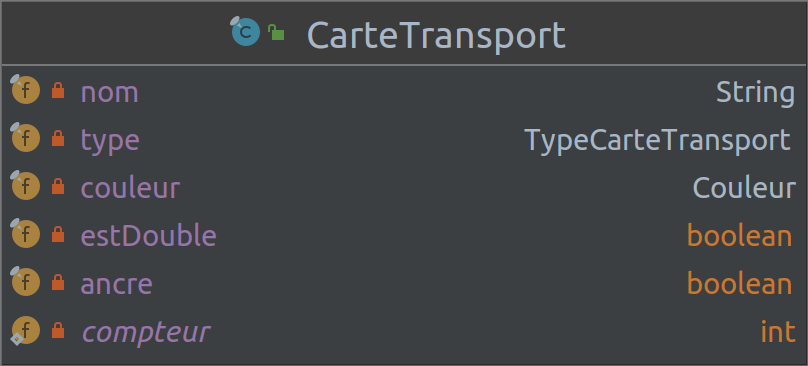
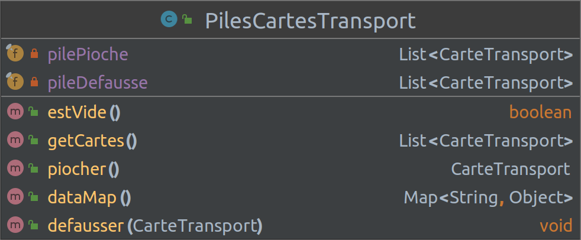
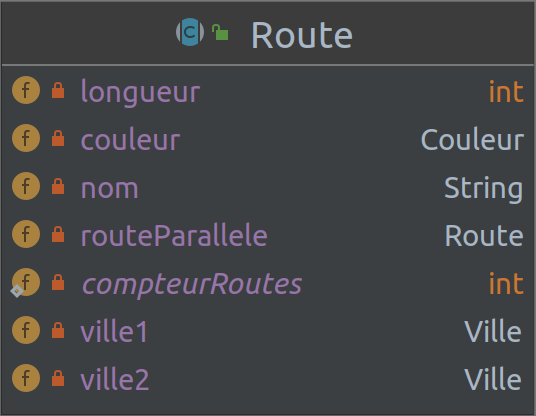

# Projet - _Aventuriers du Rail Autour du Monde_

### IUT Montpellier-Sète – Département Informatique

Ce projet a lieu dans le cadre des Situations d'Apprentissage et Évaluation du BUT Informatique (SAE S2.01 et S2.02). Il fera intervenir plusieurs compétences acquises durant le Semestre 2 : le développement orienté objets, les notions de qualité de développement (tests unitaires, gestion de version, etc), les algorithmes de graphes et les interfaces homme-machine.

## Calendrier de travail
Le projet a été conçu pour être réalisé de façon incrémentale en 3 phases :

* **Phase 1 : _développement de la mécanique du jeu en Java_**
    * **Période :** 20 février -- 24 mars 2023
    * **Cours concerné** : [_Développement Orienté Objets_](https://gitlabinfo.iutmontp.univ-montp2.fr/dev-objets)
    * **Enseignants :**
      [Marin Bougeret](mailto:marin.bougeret@umontpellier.fr),
      [Romain Lebreton](mailto:romain.lebreton@umontpellier.fr),
      [Cyrille Nadal](mailto:cyrille.nadal@umontpellier.fr),
      [Victor Poupet](mailto:victor.poupet@umontpellier.fr),
      [Gilles Trombettoni](mailto:gilles.trombettoni@umontpellier.fr),
      [Petru Valicov](mailto:petru.valicov@umontpellier.fr)
    * [Forum Piazza](https://piazza.com/class/ld2tzi5k82via) pour poser vos questions
    * **Modalités de notation de la Phase 1** :
        * tests unitaires automatisées secrets
        * individualisation des notes en fonction des contributions de chaque membre de l'équipe

  Après votre rendu, une correction pour cette phase vous sera fournie afin que vous puissiez continuer sur les phases 2 et 3 du projet.

* **Phase 2 : _mise en œuvre des algorithmes de graphes afin de définir des stratégies de jeu pour les joueurs_**
    * **Période (prévisionnelle) :** 10 ou 17 avril -- mai 2023
    * **Cours concerné** : _Graphes_
    * **Enseignants :**
      [Alexandre Bazin](mailto:alexandre.bazin@umontpellier.fr),
      [Irène Larramendy](mailto:irene.larramendy-valverde@umontpellier.fr),
      [Alain Marie-Jeanne](mailto:alain.marie-jeanne@umontpellier.fr)
    * **Modalités de notation de la Phase 2** :
        * implémentation en Java du code : 40%
        * interrogation écrite individuelle : 60%\
          l'interrogation portera sur les principes algorithmiques dans la réalisation de cette phase du projet.

* **Phase 3 (suite de la Phase 1) : _implémentation d'une interface graphique sous [JavaFX](https://openjfx.io/)_**
    * **Période (prévisionnelle) :** fin avril -- juin 2023
    * **Cours concerné** : _[Développement d’applications avec IHM](https://gitlabinfo.iutmontp.univ-montp2.fr/ihm)_
    * **Enseignants :**
      [Sophie Nabitz](mailto:sophie.nabitz@univ-avignon.fr),
      [Cyrille Nadal](mailto:cyrille.nadal@umontpellier.fr),
      [Nathalie Palleja](mailto:nathalie.palleja@umontpellier.fr),
      [Xavier Palleja](mailto:xavier.palleja@umontpellier.fr),
      [Petru Valicov](mailto:petru.valicov@umontpellier.fr)
    * **Modalités de notation de la Phase 3** : À définir ultérieurement

## Notation des SAE 1 et SAE 2
* **SAE 1 :** note de la Phase 1 : 50%,  note de la Phase 3 : 50%
* **SAE 2 :** note de la Phase 1 : 30%, note de la Phase 2 : 70%

## Consignes générales
Vous devez commencer par lire [les règles du jeu](documents/Aventuriers%20du%20rail%20autour%20du%20monde%20-%20Règles.pdf). Une vidéo de présentation du jeu est disponible [ici](https://www.youtube.com/watch?v=9hevLj-3t00&ab_channel=ExtraLifefr).

Un squelette du code vous est fourni et vous devrez :
* écrire le corps des fonctions non implémentées qui vous sont fournies
* ajouter des fonctions/attributs/classes là où cela vous semble utile
* vérifier que votre programme marche en faisant des tests unitaires
* sauf indication explicite de la part des enseignants, ne pas modifier la signature des méthodes/attributs/classes qui vous sont données

Des consignes détaillées du projet vous sont données dans le fichier [Consignes.md](Consignes.md).

Pensez à consulter régulièrement le [FAQ](https://gitlabinfo.iutmontp.univ-montp2.fr/dev-objets/projets/aventuriers-monde/-/blob/master/FAQ.md). Vous serez informés s'il y a des nouveautés (surveillez le [Forum Piazza](https://piazza.com/class/ld2tzi5k82via)).

Elles seront complétées pour chaque phase au fur et à mesure et vous en serez informés.

_**Le non-respect de ces consignes aura des fortes implications sur la note finale.**_

## Présentation
Le but de ce projet est de produire une implémentation en _Java_ du jeu de plateau _Aventuriers du Rail Autour du Monde_.

**Attention** : seul le plateau "_Monde_" est à implémenter, le plateau auxiliaire "_Les Grands Lacs_" ne sera pas considéré dans ce projet.

Le principe du jeu est de construire des tronçons de chemin de fer prédéterminés entre des villes sur une carte du monde. Lorsqu'un tel tronçon est construit on dit que la route entre les villes correspondantes est **capturée**. Au début de la partie chaque joueur reçoit des missions, que l'on appellera **destinations**, consistant à relier deux villes plus ou moins éloignées. Donc pour réaliser ces missions, les joueurs devront capturer des routes entre les différentes villes étapes.

Naturellement, pour capturer une route il faut payer ! Et pour cela, chaque joueur a besoin des **cartes de transport** (_Wagon_ ou _Bateau_). Ainsi, afin de capturer une route le joueur doit défausser des cartes de transport correspondantes. Une fois la route capturée, le joueur pose des pièces _trains_ ou _wagons_ sur cette route pour marquer sa prise.

Pour pouvoir poursuivre la lecture, il faudra se familiariser avec [les règles du jeu](documents/Aventuriers%20du%20rail%20autour%20du%20monde%20-%20Règles.pdf).

## Architecture générale du code
Le projet est structuré en 3 paquetages :`fr.umontpellier.iut.gui`, `fr.umontpellier.iut.rails` et `fr.umontpellier.iut.rails.data`. Les classes du paquetage `fr.umontpellier.iut.gui` servent uniquement à l'interface graphique et, sauf indication contraire, vous n'aurez pas à les modifier.

Les 2 autres paquetages `fr.umontpellier.iut.rails` et `fr.umontpellier.iut.rails.data`, représentent le code métier du projet. Voici son diagramme de classe simplifié :

Les classes du paquetage `fr.umontpellier.iut.rails.data` contiennent des classes "de données" décrivant les différents éléments du jeu. Leur contenu devrait être suffisant dans votre travail. Cependant, si vous l'estimez nécessaire, vous pouvez ajouter des fonctions ou attributs à ces classes.

Les classes que vous aurez à compléter sont situées dans `fr.umontpellier.iut.rails`.

**Important : Sauf indication contraire, les declarations des attributs et les signatures des méthodes qui vous sont données, doivent rester intact.**

### Les cartes transport
Il existe 4 types de cartes transport : _Wagon_, _Bateau_, _Double-bateau_ et _Joker_. Les trois premières peuvent être de 6 couleurs différentes correspondantes aux couleurs des routes présentes sur le plateau connectant des villes – bleu, violet, orange, blanc, vert, jaune, noir et rouge. Voici la classe `CarteTransport` :

Cette classe est une classe presque entièrement immuable, à savoir tous les attributs dynamiques sont `final`. Le code de cette classe vous est intégralement donnée, et vous ne devriez pas la modifier (mais vous pouvez y ajouter des méthodes si vous l'estimez nécessaire).

D'après les [règles](documents/Aventuriers%20du%20rail%20autour%20du%20monde%20-%20Règles.pdf), lorsqu'un joueur choisit de prendre des cartes transport, il peut en piocher jusqu'à 2 par tour. Chacune de ces cartes doit être soit prise parmi les six faces visibles, soit tirée du dessus de la pioche.

Un joueur peut conserver en main autant de cartes terrestres qu'il le souhaite durant la partie. Si la pioche est épuisée, la défausse est mélangée pour constituer une nouvelle pioche.

#### Melange des cartes : cas particuliers

Il se peut que la pioche et la défausse soient simultanément épuisées (si les joueurs ont gardé toutes les cartes en main). Dans ce cas, le joueur dont c’est le tour ne peut pas piocher des cartes transport et se contentera des cinq autres options : prendre possession d'une route, piocher de nouvelles cartes Destination, bâtir un port ou échanger des pions, prendre des cartes visibles (s'il en reste).

D'autres cas tordus sont à prévoir :
1. Au début du tour de chaque joueur, normalement il devrait y avoir 6 cartes visibles. Cependant, comme indiqué précédemment, plusieurs joueurs pourraient garder toutes les cartes en main. De plus, ils pourraient continuer à prendre dans les cartes visibles. Ce qui implique qu'il pourrait y avoir moins de 6 cartes visibles. Par conséquent, si au début du tour du joueur courant, il y a moins de 6 cartes visibles, alors **dans le cas où c'est possible**, ce joueur les remplira avec les cartes disponibles (au choix, en fonction de la quantité des cartes dans chacune des 2 pioches).

1. Lorsque 3 _Jokers_ sont présentés face visible, d'après les [règles](documents/Aventuriers%20du%20rail%20autour%20du%20monde%20-%20Règles.pdf), il faut défausser toutes les cartes visibles et révéler 3 cartes de la pioche _Wagon_ et 3 cartes de la pioche Bateau.
    * Si l'une de ces 2 pioches a strictement moins de 3 cartes, alors il faut révéler toutes les cartes de cette pioche et compléter à 6 avec les cartes de l'autre pioche. Si le nombre total des cartes dans les 2 pioches est inférieur à 6, alors toutes les cartes sont retournées.
    * Dans certains cas l'application des [règles initiales du jeu](documents/Aventuriers%20du%20rail%20autour%20du%20monde%20-%20Règles.pdf) provoquerait un mélange perpétuel... Par exemple, si la pioche _Wagon_ contient 3 cartes et toutes sont des _Joker_ ; ou si la pioche _Wagon_ contient 3 _Jokers_ et une carte Wagon, alors que la pile bateau est vide ; etc. Dans de telles situations, vous laisserez les cartes visibles telles quelles (pas de défausse, pas de redistribution).

**Attention** : pour les différents cas de figure, il faudra écrire beaucoup de tests unitaires pour vérifier la validité de votre code.

### La défausse et la pioche
La classe `PilesCartesTransport` encapsule les deux piles de carte de transport : pioche et défausse. Le code du constructeur et de la fonction `dataMap()` doivent rester inchangés. Les fonctions `estVide()`, `piocher()` et `defausser()`permettent de gérer correctement les deux piles de cartes. Nous vous conseillons de démarrer votre projet par l'implémentation de ces méthodes.

### Les _Routes_
Pour prendre possession d'une route, le joueur doit jouer des cartes transport de la couleur et type correspondants, en quantité suffisante (voir les [règles](documents/Aventuriers%20du%20rail%20autour%20du%20monde%20-%20Règles.pdf) du jeu pour les détails).

La classe `Route` est une classe abstraite, super-classe des différents types de routes. Son code, ainsi que celui de ses sous-classes, vous sont donnés. Vous aurez à les compléter en y ajoutant des attributs et des méthodes. Lors de la capture d'une route, votre programme doit augmenter le score du joueur correctement en fonction de la longueur de la route (voir [règles](documents/Aventuriers%20du%20rail%20autour%20du%20monde%20-%20Règles.pdf)).

Diagramme de classe simplifié de `Route` :

### Les _Destinations_
La classe `Destination` encapsule les informations sur les _Destinations_ dans le jeu. Si besoin, vous pouvez y ajouter des attributs et méthodes qui vous semblent nécessaires.

Dans la **Phase 1** du projet, vous devez calculer si une destination d'un joueur est réalisée, à savoir est-ce que la première et la dernière ville sont reliées par une route (terrestres et/ou maritime) du joueur.

**Important :** Le calcul des points bonus accordés pour la réalisation des _Destinations Itinéraire_, n'est pas demandé pour la **Phase 1**. Cette partie sera à faire lors de la Phase 2 du projet.

### Les classes `Jeu` et `Joueur`
Ce sont les classes principales de votre application. La plus grande partie de votre travail consistera à les completer.

### Fin du jeu
Le déclenchement de la fin de la partie a lieu lorsqu'un joueur, disons **_toto_**, vient de capturer une route et sa réserve de pions passe à &le; 6 pièces (trains et bateaux confondus). Ainsi, après le tour de **_toto_**, chaque joueur, en incluant **_toto_**, joue encore deux tours. À la fin, le jeu s'arrête et chacun compte ses points.

**Rappel important :** dans la **Phase 1** du projet, il vous est demandé uniquement de gérer le déclenchement de la fin de la partie et l'arrêt du jeu, en ne comptant que :
* les points obtenus à la construction des routes (en fonction de leur longueur)
* les points des pénalités pour les ports non-construits
* les points obtenus grâce à la réalisation des destinations et aux ports qui leur sont connectés
* les points de pénalités pour les destinations non-réalisées

Le décompte des points en fonction de la réalisation complète des _Destinations Itinéraires_, sera à faire lors de **Phase 2** du projet, qui démarrera au mois d'avril.

## Interface utilisateur

Pour lancer une partie :
1. Exécuter la méthode `main(String args[])` de la classe `fr.umontpellier.iut.gui.GameServer`.
2. Ouvrir dans un navigateur le fichier `svelte/public/index.html`.

Vous pourrez alors observer en parallèle l'affichage dans la console et sur l'interface graphique.

### Interface graphique (web)
Pour rendre l'expérience ludique, et pour que votre jeu rassemble à un _vrai_ jeu, une interface graphique vous est également fournie. Cette interface interprète la saisie console et affiche le jeu de manière plus proche d'un utilisateur non-informaticien dans un navigateur web. Vous n'aurez pas à la modifier (ni à adapter votre code), cette partie étant complètement indépendante de votre projet. Nous vous conseillons d'utiliser l'interface graphique directement pour simuler votre jeu, car utiliser la console peut s'avérer particulièrement pénible.

**Important** : Des méthodes spéciales `log()`, `String lireLigne()`, `prompt()`, `toLog()` et `dataMap()` ont été ajoutées aux classes. Également les définitions des méthodes `toString()` de différentes classes de l'application sont données. Toutes ces méthodes sont nécessaires pour l'IHM. **Vous ne devriez pas les modifier !**

À tout moment vous pouvez faire un appel à la fonction `log(String)` des classes `Jeu` ou `Joueur` pour afficher des messages sur l'interface (dans le carnet en bas et à gauche de l'écran). N'hésitez pas à l'appeler et lui passer le message correspondant afin de visualiser les actions de l'utilisateur.

### Interface console
Une interface utilisateur en ligne de commandes vous est également fournie. Les informations du jeu sont affichées à l'écran en utilisant la sortie standard et les choix des joueurs peuvent se faire par lecture sur l'entrée standard (clavier). Comme dit précédemment, il vaut mieux privilégier l'interface web qui vous est fournie pour faire vos simulations.

**Important** : Si vous êtes amenés à faire des modifications du code gérant l'affichage, pour notamment afficher des informations supplémentaires, vous veillerez à ce que cela n'affecte pas le fonctionnement général de ces fonctions.

## Rendu attendu

L'intégralité du code source du projet doit résider dans le dépôt GitLab associé à votre équipe de projet. Vous devez compléter les classes Java qui vous sont données et ajouter des nouvelles classes si nécessaire.

Toutes les méthodes qui lèvent une exception avec l'instruction `throw new RuntimeException("Méthode non implémentée !")` doivent être complétées selon les spécifications (en respectant leurs signatures). Vous êtes encouragés à ajouter des attributs et méthodes aux classes, lorsque cela vous semble nécessaire. La modification du corps des méthodes qui vous sont fournies est possible à condition de ne pas modifier le fonctionnement général de ces fonctions (décrit dans la spécification des méthodes).

**Rappel : pas de modification des signatures des méthodes/attributs qui vous sont fournis.**

## Évaluation

L'évaluation du projet se fera à l'aide de tests unitaires automatisés. Un premier jeu de tests vous est fourni (comme d'habitude dans le répertoire `src/test/java`) pour que vous puissiez vérifier le bon fonctionnement des fonctionnalités de base. Puis, nous utiliserons un second jeu de tests (secret) pour l'évaluation finale.

Il est donc attendu que les projets rendus passent le premier jeu de tests sans erreurs, mais vous devez également vérifier par vous-mêmes (en écrivant d'autres tests unitaires) que le projet se comporte correctement dans les différents cas particuliers qui peuvent se produire et qui ne sont pas nécessairement couverts par les tests qui vous ont été fournis.

**Remarque importante** : puisque l'évaluation des rendus se fait par des tests automatisés, **les projets qui ne compilent pas ou qui ne respectent pas les signatures données, seront automatiquement rejetés** et la note sera 0.
